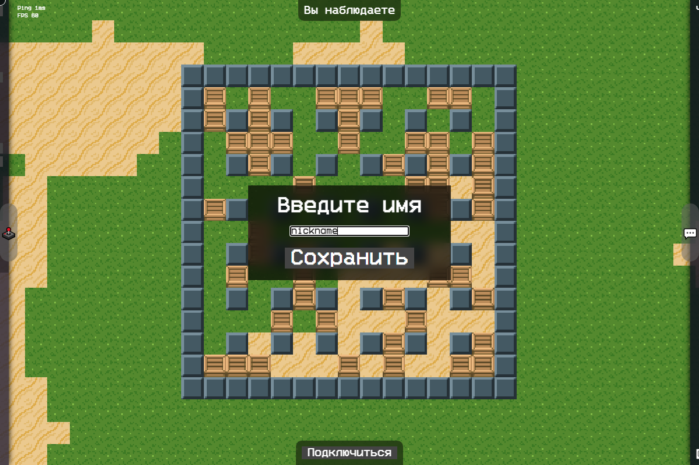
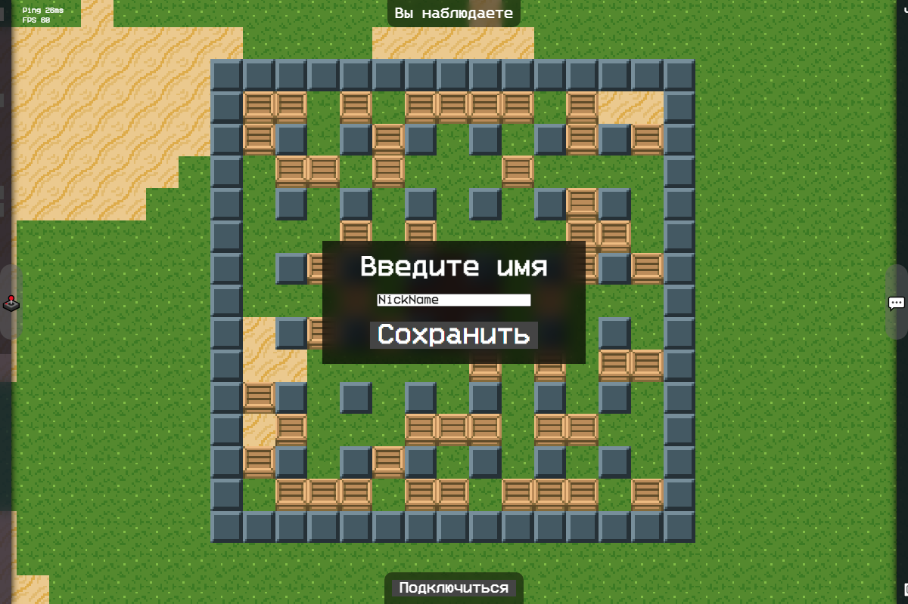
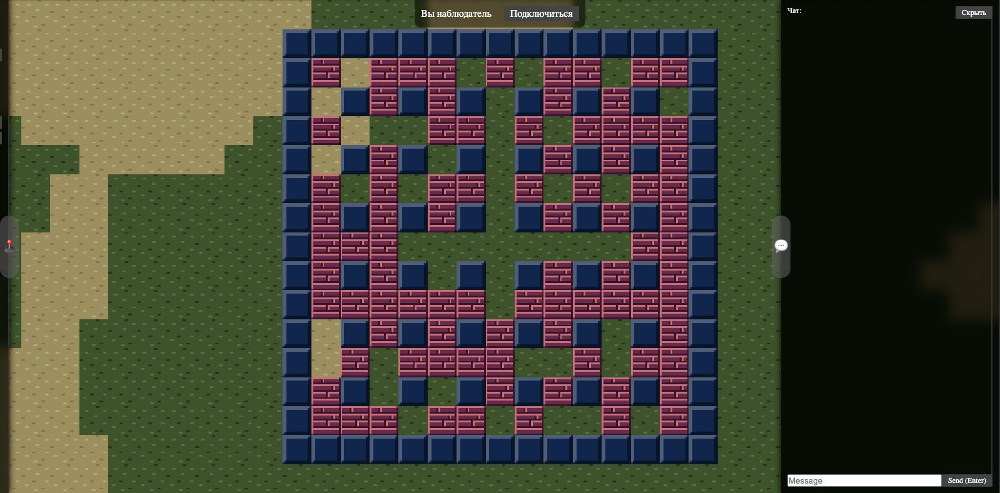
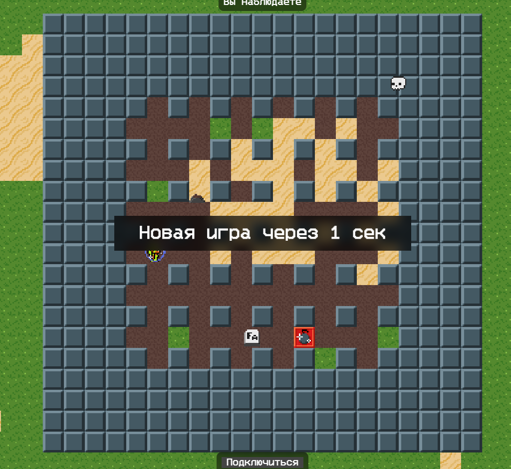
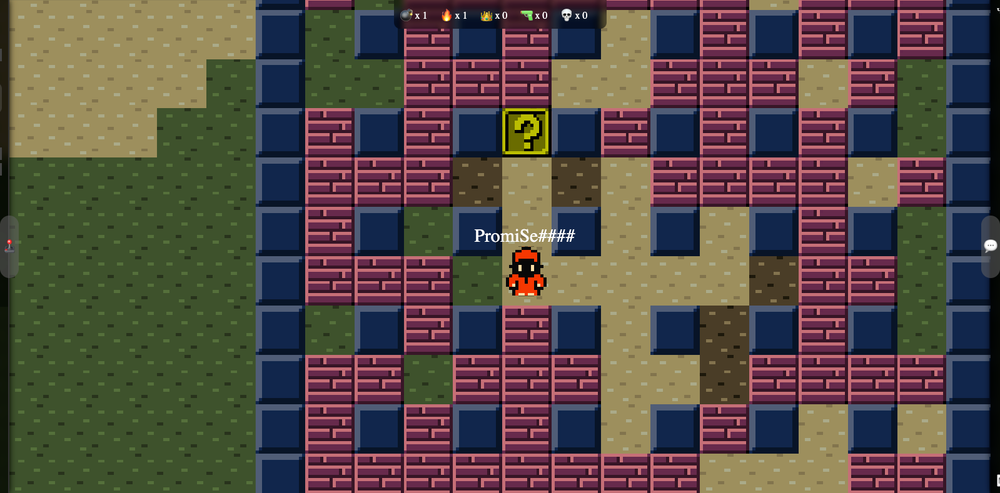

# Почти классический Bomberman

Запустил игрульку [тут](https://openbomber.ru)

## Игровой процесс
Игрок появляется в одной из спавн позиций на карте. Карта состоит из блоков которые можно разрушить (кирпичи), которые нельзя разрушить (стены). Игрок может перемещаться и устанавливать бомбы используя джойстик на экране мобильного или Gamepad или (WASD + Space) или (Стрелочки + Enter). После установки бомбы у игрока есть 2 секунды, чтобы спрятаться от взрыва, который распространяется во все стороны на определенный радиус. Изначально игрок может ставить только одну бомбу на карту, которая взрывается на радиус 1 от центра. Взрыв бомбы разрушает кирпичи и убивает игроков. Взрыв бомбы на карте держится 500 миллисекунд. В зависимости от настроек генерации карты, кирпичи могут содержать бусты (по умолчанию 15 % всех кирпичей), которые появляются при разрушении кирпичей.  Взрыв бомбы так же может разрушить буст, если тот встанет у него на пути. Распространение взрыва бомбы останавливается кирпичами, стенами, бустами. 

## Игровые бусты
- +бомба (Увеличение количество одновременно стоящих бомб игрока на карте. Складывается с предыдущими. Не сохраняется на новые игры.)
- +радиус (Увеличение радиуса взрыва бомбы. Складывается с предыдущим. Применяется только к новым установленным бомбам. Не сохраняется на новые игры.)
- +скорость (Увеличение скорости игрока. Выдаётся на время 25 сек. Складывается время с предыдущими. Уменьшает время - скорость, если уже активирован. Не сохраняется на новые игры.)
- -скорость (Уменьшение скорости игрока. Выдаётся на время 25 сек. Складывается время с предыдущими. Уменьшает время + скорость, если уже активирован. Поджигает игрока, давая возможность убивать прикосновением.  Не сохраняется на новые игры.)
- щит (Защищает игрока от 1 взрыва. Выдаётся на время 50 сек. Складывается время с предыдущими. Пропадает сразу же, как только защитил игрока от взрыва. Не сохраняется на новые игры.)
- шальная бомба (Заменяет классические бомбы шальными. Шальная бомба может взорваться за время от 500 до 5000 миллисекунд, может иметь радиус от номинального (суммы + радиус) до (суммы + радиус) умноженного на 5. Имеет шанс 10% не взорваться. Выдаётся на время 30 сек. Складывается по времени с предыдущими. Не сохраняется на новые игры.)
- пинание бомб (Позволяет игроку пинать бомбы. Бомба летит пока не встретит препятствие. Выдаётся на время 35 сек. Складывается время с предыдущими. Не сохраняется на новые игры.)
- случайный (Выдаёт случайный буст игроку.)

## Скриншоты








## Для запуска 
```bash
> npm i
> npm run dev
```

## Для билда
```bash
> npm i
> npm run build
```

## Чтобы проверить сервер
```bash
> npm i
> npm run preview
```

## Donate
- Поддержать меня можно на [Boosty](https://boosty.to/vic_dev) и/или на [DonationAlerts](https://www.donationalerts.com/r/promise")
- Ссылка на наш [Discord сервер](https://discord.gg/JzapKXFqzt)
- Ссылка на [группу вк](https://vk.com/openbomber)
- Ссылка на [группу тг](https://t.me/gameopenbomber)
